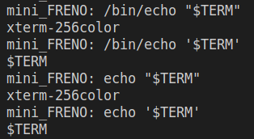
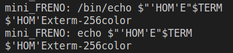
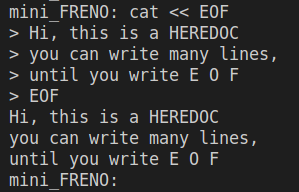
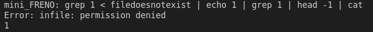
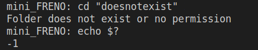
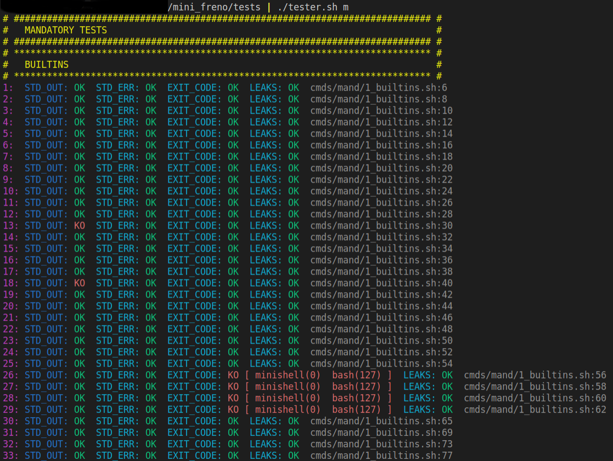

# mini_freno
A shell like bash, written in C with only basic functionality. Some commands have been rewritten as a built-in, such as: echo, cd, pwd, export, unset, env and exit.

So /bin/echo will call the system's echo, whereas just echo calls the built-in. They should behave the same and handle single and double quotes correctly. So variables in "" should show the actual value, whereas '' just show the dollar-sign. This is shown in Fig. 1. An unusual use of variables and quotes is shown in Fig. 2.

**Figure 1** - Dollar handling in echo.

**Figure 2** - Unusual input in echo.

The possibility to use heredocs is shown in Fig. 3. The contiguous flow of data from one command to the next by pipes ("|") is also implemented, and also the error management resembles bash's behavior (see Fig. 4). 

**Figure 3** - Heredocs can be used.

**Figure 4** - Commands connected by pipes and error handling.

Although the error management is based on bash, the actual error codes sometimes differ. For non existing folders bash uses the error code 1 and here it is -1 (see Fig. 5).

**Figure 5** - Error code "-1" differs to bash's "1".

 For a final comparison and check every command has to be typed twice, once in a bash terminal and in mini_freno. And the output has to be compared. In oder to mitigate the work load [tjensen](https://github.com/tjensen42/42-minishell) has written a tester which includes a way to send a list of commands directly to each shell. The different error code output of mini_freno makes a comparison to bash complicated. Furthermore are some tests including a tab not possible on every machine. Sometimes it triggers the auto-complete function and is not converted correctly. That means some tests still have to be typed and compared by hand, but not as many. For development and to make sure one fix does not break other functionalities this tester was highly appreciated. Some output including are shown in see Fig. 6. Due to the tab-handling and error return codes some false negative tests remain.

 

**Figure 6** - Output from the tester. Bash's behavior is compared to mini_freno in the categories standard and error output, exit code If there have not been any leaks "OK" is printed.

